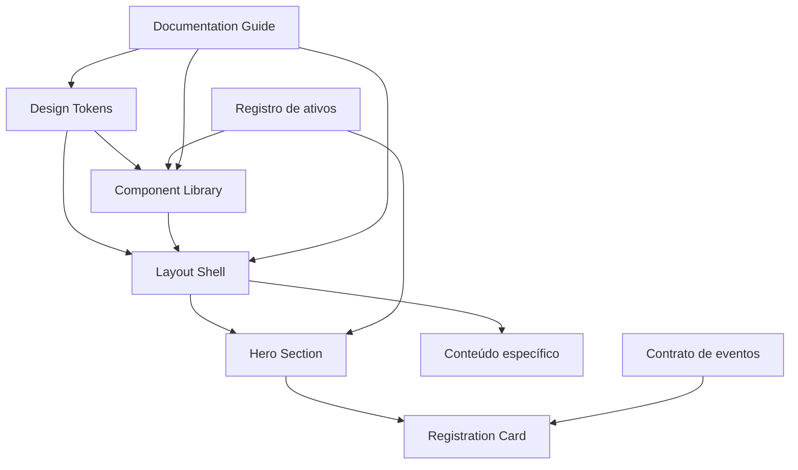
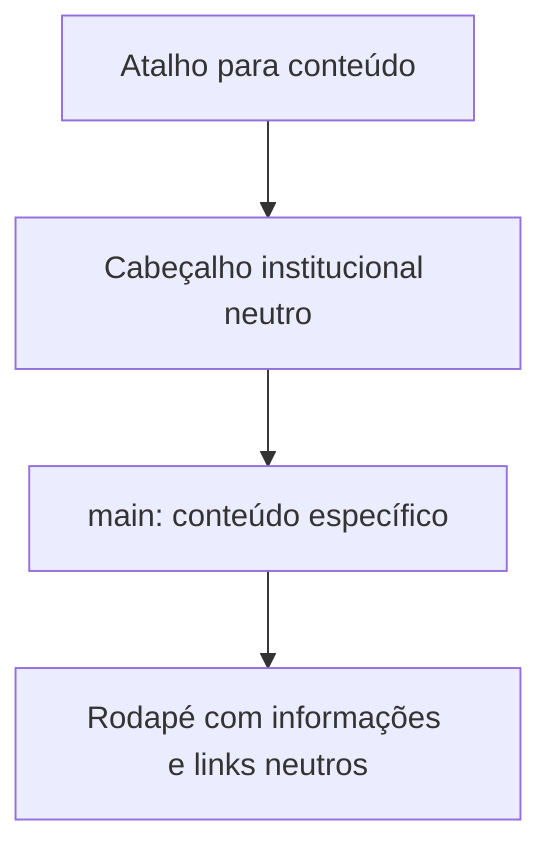

# Design técnico — UniCore

## Overview

O **UniCore** define o **UniCore_Design_System**, um sistema de design original e proprietário para futuras telas do portal UniCore. Ele define tokens, componentes, composição responsiva, contratos de acessibilidade, ativos e eventos. Os exemplos usam apenas Conteúdo_Neutro e não representam marca, instituições, pessoas, imagens, textos, ícones, fluxos ou estruturas externas.

A direção visual permitida é estritamente abstrata: modo escuro, alto contraste, superfícies grafite, acento verde e destaque para um formulário. Não há reprodução de referência visual. `Design_Tokens`, `Component_Library`, `Layout_Shell`, `Hero_Section` e `Registration_Card` são criações originais do UniCore_Design_System.

### Pesquisa que informou o design

A pesquisa se concentrou em acessibilidade de contraste, foco e formulários. As diretrizes da [W3C sobre foco visível](https://www.w3.org/WAI/WCAG22/Understanding/focus-visible) e [aparência do foco](https://www.w3.org/WAI/WCAG22/Understanding/focus-appearance) fundamentam o foco persistente, perceptível e contrastante. A associação explícita entre rótulos e controles segue a orientação da [W3C para rótulos de formulário](https://www.w3.org/WAI/GL/2015/WD-UNDERSTANDING-WCAG20-20150106/minimize-error-cues.html). O conteúdo foi resumido e reescrito para conformidade com licenças.

## Architecture

A camada de tokens é a fonte normativa de valores visuais. A biblioteca consome somente tokens; o `Layout_Shell` organiza cabeçalho, principal e rodapé; os componentes de página são compostos sem dependência de identidade externa. Conteúdo, destinos de CTA, campos e integração são entradas configuráveis, não tokens nem elementos de marca.

### Decisões

- Usar papéis semânticos (`background`, `surface`, `text`, `action`) reduz acoplamento a uma única tela e mantém a identidade consistente.
- Tratar imagem e integração como contratos explícitos impede introdução silenciosa de ativos não autorizados e preserva o formulário quando falhas ocorrerem.
- A grade usa três faixas declarativas, em vez de posicionamento absoluto, para evitar sobreposição e rolagem horizontal.

## Modelo de tokens

| Grupo | Token | Valor | Finalidade e uso |
|---|---|---:|---|
| Cor | `color-background` | `#101311` | Fundo global do shell |
| Cor | `color-surface` | `#181D1A` | Cabeçalho e campos |
| Cor | `color-surface-elevated` | `#222A25` | Cards e painéis elevados |
| Cor | `color-campaign-black` | `#0B0D0C` | Contrapeso da área de campanha |
| Cor | `color-text-primary` | `#F5F7F4` | Texto principal sobre fundos escuros |
| Cor | `color-text-secondary` | `#B9C3BC` | Texto de apoio |
| Cor | `color-action-green` | `#49D17D` | Acento, campanha e borda do formulário |
| Cor | `color-action-primary-background` | `#F5F7F4` | Fundo do botão primário |
| Cor | `color-action-primary-text` | `#101311` | Texto do botão primário |
| Cor | `color-border` | `#58675C` | Bordas padrão |
| Cor | `color-focus` | `#8EF0B3` | Anel de foco visível |
| Cor | `color-error` | `#FF7A7A` | Erro textual, ícone informativo e borda |

| Grupo | Token | Valor | Finalidade e uso |
|---|---|---:|---|
| Tipografia | `font-family-sans` | fonte sem serifa autorizada | Única família; o registro do ativo informa licença/autorização |
| Tipografia | `font-weight-*` | 400, 500, 600, 700 | Corpo, ênfase, controles e títulos |
| Tipografia | `font-size-*` | 12, 14, 16, 20, 24, 32, 40 px | Escala tipográfica; corpo em 16 px por padrão |
| Tipografia | `line-height-body` | 1,5 | Corpo, rótulos, ajuda e erro |
| Espaço | `space-*` | 4, 8, 12, 16, 24, 32, 40, 48, 64 px | Separação e preenchimento; nenhum valor arbitrário |
| Raio | `radius-*` | 4, 8, 12, 16, 999 px | Controles, cards e cápsulas |
| Sombra | `shadow-raised` | `0 8px 24px rgba(0,0,0,0.28)` | `Registration_Card` e card elevado |
| Sombra | `shadow-overlay` | `0 16px 40px rgba(0,0,0,0.40)` | Sobreposição excepcional |

**Pares normativos:** texto primário sobre `color-background`, `color-surface`, `color-surface-elevated` e `color-campaign-black`; texto secundário apenas onde conservar 4,5:1; texto do botão primário sobre seu fundo; `color-focus` contra a superfície adjacente. A revisão deve medir cada novo par: texto normal requer 4,5:1; texto grande, controles e indicadores essenciais requerem 3:1 ou mais. Cor nunca é o único sinal de estado.

## Layout Shell

- **Cabeçalho:** superfície `color-surface`; identificação neutra do portal, navegação principal, busca e ação de destaque. A ordem no DOM é a ordem visual e de teclado. O item da página recebe `aria-current="page"`, alteração de cor e indicador adicional (sublinhado/faixa de espessura perceptível).
- **Principal:** único marco `main`, recebe o conteúdo específico entre cabeçalho e rodapé. O atalho inicial foca esse marco antes do conteúdo repetitivo.
- **Rodapé:** informações do projeto e links complementares neutros; não cria rótulos ou identidade de terceiros.

## Grade e breakpoints

| Composição | Viewport | Grade | Contêiner e calha | Regra da Hero |
|---|---:|---|---|---|
| Compacta | 0–767 px | 4 colunas | margem 16 px; calha 16 px | texto, imagem e formulário em uma coluna, nesta ordem |
| Intermediária | 768–1199 px | 8 colunas | margem 32 px; calha 24 px | texto e formulário em blocos de largura disponível, sem sobreposição; a imagem permanece em bloco responsivo |
| Ampla | ≥1200 px | 12 colunas | máx. 1200 px; margem automática; calha 24 px | bloco promocional e formulário em colunas adjacentes; imagem integra o bloco promocional |

O contêiner usa `width: 100%` até o máximo aplicável, elementos internos permitem quebra de palavras e mídia tem largura fluida. Nenhum componente depende de largura fixa que exceda sua coluna; mudanças de faixa preservam controles visíveis, operáveis e sem rolagem horizontal.

## Components and Interfaces

### Botões e controles de ação

As variantes originais são: **primária clara** (ação principal, fundo claro e texto escuro), **secundária** (superfície escura e borda) e **textual** (navegação/ação de baixa ênfase). Anatomia: rótulo neutro obrigatório; ícone opcional somente como apoio; área acionável; indicador de foco. Tamanhos usam altura confortável, preenchimento por `space-*` e rótulo que pode quebrar em múltiplas linhas sem corte.

| Estado | Sinal visual e comportamental |
|---|---|
| Padrão | variante, rótulo e área acionável definidos |
| Hover | mudança de superfície/borda **e** elevação ou sublinhado perceptível |
| Foco | anel de `color-focus`, mínimo 2 px, externo, sem ocultar rótulo |
| Pressionado | redução/alteração de elevação e superfície, preservando texto |
| Desabilitado | contraste e opacidade controlados, cursor/semântica desabilitada e fora da ação |
| Erro (controles validáveis) | borda e mensagem textual/ícone informativo; não apenas cor |

Entrada de texto, seleção e caixa de seleção compartilham anatomia: rótulo visível associado ao controle, indicador de obrigatório quando aplicável, ajuda opcional, valor, área de foco e mensagem de erro. Ícones decorativos usam `aria-hidden="true"`; ícones informativos recebem nome acessível. Cada controle expõe nome, função, valor/estado e invalidez programática (`aria-invalid` quando aplicável).

### Card, cabeçalho, navegação e mensagem de erro

- **Card:** contêiner de conteúdo com título opcional, corpo e ações; permite conteúdo longo com fluxo vertical e quebra de linha.
- **Cabeçalho e navegação:** componentes semânticos (`header`, `nav`, lista de links) com nome acessível da navegação.
- **Mensagem_de_Erro:** texto específico próximo ao campo, ligado por `aria-describedby`; erro do campo definido programaticamente e mensagem anunciada em região apropriada de status/alerta sem duplicação excessiva.
- **Regra transversal de conteúdo:** textos, controles e imagens permanecem visíveis; a solução para excesso é reflow e expansão vertical, nunca truncamento, sobreposição ou rolagem horizontal.

### Hero_Section

**Anatomia:** rótulo opcional de campanha, título neutro, descrição neutra, CTA, área de mídia e relação espacial com `Registration_Card`. Fundo combina `color-action-green` e `color-campaign-black` em composição exclusiva do projeto. O título, a descrição e a CTA só usam pares de tokens aprovados pelo contraste mínimo.

A mídia fica ao lado ou abaixo do conteúdo conforme a grade. Se comunica informação, deve ter texto alternativo que descreva essa informação; se for puramente decorativa ou fundo, é removida da árvore de acessibilidade (por exemplo, `alt=""` quando aplicável). A CTA é uma ação real: com destino configurado, navega para ele; sem destino, permanece visível na página atual e não provoca redirecionamento.

### Registration_Card

O componente destacado usa `color-surface-elevated`, borda de 1 px em `color-action-green`, `radius-16` e `shadow-raised`. Anatomia: título neutro de finalidade, texto de apoio opcional, campos rotulados, ajuda/erro por campo, aceite opcional e botão de envio. Campos usam `color-surface` e `color-text-primary`; seu foco recebe anel em `color-focus` com contraste mínimo de 3:1 contra cores adjacentes.

**Estados:** edição válida, foco, erro de validação, envio em andamento, envio concluído e falha de integração. Em erro, o cartão preserva contexto e associa a `Mensagem_de_Erro` ao campo; em envio, previne reativação concorrente; em falha, mostra mensagem geral acessível e preserva todos os valores. O cartão não presume quais dados são solicitados: o contrato de configuração define campos, regras e textos neutros.

## Data Models

| Entidade | Campos normativos | Regras |
|---|---|---|
| `AssetRecord` | `id`, tipo, origem, finalidade, autorização, data de revisão | obrigatório antes de documentar/usar ativo; ativo externo identificável é inelegível |
| `HeroConfig` | título, descrição, CTA, destino opcional, mídia, `mediaPurpose` | mídia é `informative` com alt descritivo ou `decorative` sem exposição assistiva |
| `FieldConfig` | `id`, rótulo, tipo, obrigatório, ajuda, regras de validação, ícone opcional | rótulo visível e associação programática obrigatórios |
| `RegistrationState` | valores, erros por campo, estado de envio, erro geral | valores sobrevivem a erro remoto; estado impede duplicidade |
| `ScreenReview` | tokens, componentes, breakpoints, ativos, achados de acessibilidade, checklist | registro obrigatório de conformidade para usar a aparência padrão |

### Contrato de eventos

- `hero_cta_activated`: `{ destination?: string }`. Navega apenas quando `destination` estiver configurado; ausência é tratada como operação segura sem navegação.
- `registration_submit`: `{ activationId, values }`. É emitido **uma única vez por ativação válida**. `activationId` identifica a tentativa e o componente bloqueia novo disparo enquanto houver envio pendente.
- `registration_result`: `{ activationId, status: "success" | "failure", message?: string }`. Resultados com identificador não correspondente são ignorados; `failure` muda o estado para falha, anuncia mensagem e não limpa valores.

## Correctness Properties

*Uma propriedade é um comportamento que deve permanecer verdadeiro para todas as execuções válidas dentro de um domínio definido. Nesta especificação, as propriedades transformam os contratos de CTA, responsividade, formulário e acessibilidade em verificações automatizáveis e rastreáveis.*

As propriedades abaixo serão implementadas com **fast-check** (ou biblioteca equivalente caso a implementação não seja JavaScript/TypeScript), com no mínimo 100 casos por propriedade. A reflexão de propriedades consolidou os pares de regras que descrevem a mesma invariável: as duas condições da CTA formam uma única propriedade total; validação e anúncio de erro compartilham um único fluxo; e os requisitos de reflow da biblioteca e dos breakpoints integram a mesma propriedade de layout. Cada teste terá comentário no formato `Feature: unicore, Property N: <título>`.

### Property 1: Navegação total e segura da CTA

**Validates: Requirements 4.7, 4.8**

**Formato de propriedade:** Para toda `HeroConfig` e toda ativação de CTA, se `destination` contiver um destino configurado válido, a ativação deverá produzir exatamente um comando de navegação para esse mesmo destino; se `destination` estiver ausente, não deverá produzir comando de navegação, redirecionamento ou ocultação da CTA.

**Estratégia de geração/teste:** Gerar destinos internos e URLs válidas, além do caso sem destino; acionar a CTA com um adaptador de navegação simulado e verificar a contagem, o destino do comando e a permanência da CTA no DOM. Os casos sem destino incluem `undefined`, string vazia normalizada e espaços normalizados para ausência.

### Property 2: Reflow sem rolagem horizontal nas faixas previstas

**Validates: Requirements 6.7, 7.4, 7.5, 7.6, 7.7**

**Formato de propriedade:** Para toda largura de viewport pertencente às faixas compacta (0–767 px), intermediária (768–1199 px) ou ampla (≥1200 px), e para todo conteúdo permitido de tamanho variável, o layout deverá aplicar a composição da faixa, manter textos e controles inteiramente visíveis e operáveis, e satisfazer `scrollWidth <= clientWidth` no documento e nos contêineres de layout relevantes.

**Estratégia de geração/teste:** Gerar larguras nos limites e no interior de cada faixa, títulos, rótulos, mensagens de erro e CTAs curtos/longos, além de mídia responsiva simulada. Em navegador headless, medir `scrollWidth`, `clientWidth` e retângulos de elementos para detectar overflow, corte ou sobreposição; verificar ordem empilhada na faixa compacta, blocos sem interseção na intermediária e colunas adjacentes na ampla.

### Property 3: Validação inválida bloqueia o envio e associa o erro

**Validates: Requirements 5.7, 5.8, 8.7**

**Formato de propriedade:** Para toda configuração válida de campo e todo conjunto de valores que viole ao menos uma regra de validação, uma tentativa de envio não deverá emitir `registration_submit`; cada campo inválido deverá expor `aria-invalid="true"`, uma `Mensagem_de_Erro` textual associada por identificador acessível e um mecanismo anunciável para tecnologias assistivas.

**Estratégia de geração/teste:** Gerar `FieldConfig` com combinações de obrigatório, tipo e regras, e valores inválidos correspondentes (vazio, formato incorreto, limite excedido). Submeter o cartão com emissor simulado e inspecionar zero eventos, atributos de invalidez, relação `aria-describedby` e região de status/alerta associada ao erro.

### Property 4: Uma ativação válida emite somente um evento enquanto pendente

**Validates: Requirements 5.8**

**Formato de propriedade:** Para todo conjunto de valores válidos e toda sequência de ativações consecutivas antes de um `registration_result` correspondente, a primeira ativação deverá emitir exatamente um `registration_submit` com um `activationId`; as ativações subsequentes enquanto esse identificador estiver pendente não deverão emitir eventos adicionais nem criar outro `activationId`.

**Estratégia de geração/teste:** Gerar valores válidos e sequências de um ou mais cliques, Enter ou ambos antes do resultado simulado. Registrar o emissor de eventos e verificar que há uma única emissão, que o estado fica pendente e que o controle de envio fica semanticamente desabilitado ou protegido contra reativação concorrente.

### Property 5: Falha remota preserva valores e notifica erro

**Validates: Requirements 5.9**

**Formato de propriedade:** Para todo conjunto de valores válidos submetido com sucesso à camada de eventos e para toda resposta `registration_result` de falha com o mesmo `activationId`, o estado posterior deverá manter os valores exatamente iguais aos submetidos, sair de pendência para estado operável e expor uma mensagem geral de falha acessível; resultados com outro identificador não poderão alterar esses valores nem o estado da tentativa pendente.

**Estratégia de geração/teste:** Gerar mapas de valores válidos, `activationId` e mensagens de falha, simular envio e resposta do consumidor. Comparar estruturalmente os valores pré/pós-falha, verificar o anúncio acessível e testar também identificadores divergentes antes do resultado correspondente.

### Property 6: Estados interativos preservam foco acessível e semântica

**Validates: Requirements 5.6, 6.4, 8.3, 8.4, 8.5, 8.6**

**Formato de propriedade:** Para todo controle interativo focalizável, variante e estado suportado, a interação por teclado deverá manter ordem de foco visual e funcional, nome, função e estado acessíveis; quando focalizado, o controle deverá apresentar indicador visível com contraste mínimo de 3:1 e diferença perceptível além da cor. Todo controle que não puder satisfazer esse indicador deverá estar ausente da ordem de tabulação.

**Estratégia de geração/teste:** Gerar variantes de botão, campos, seleções, caixas de seleção e seus estados permitidos em cada faixa responsiva. Percorrer a interface por teclado em navegador headless, inspecionar árvore de acessibilidade, estilos computados e contraste do foco; para estados sem indicador propositalmente configurados, verificar que o elemento não recebe foco por Tab.

## Estratégia de ativos e autoria

Todo ativo, inclusive fonte, ícone, texto, imagem e ilustração, entra com `AssetRecord` contendo origem, finalidade e autorização. A triagem rejeita qualquer proposta que contenha ou replique marca, texto, ícone, imagem, componente, layout, fluxo, estrutura ou identidade reconhecível de sistema externo. Nomes de arquivos e componentes, conteúdo visível, ícones e imagens de exemplo permanecem neutros.

A estratégia prioriza ilustrações próprias, vetores simples e imagens licenciadas para o projeto. Mídia responsiva usa alternativas de tamanho/formato sem mudar o significado; imagens informativas mantêm equivalente textual. Arte decorativa é carregada como decoração e não recebe nome acessível. A origem de substituições futuras também deve ser registrada antes da publicação.

## Error Handling

| Situação | Comportamento esperado |
|---|---|
| CTA sem destino | Não navega, não remove CTA e mantém a pessoa na tela |
| Validação local falha | Marca campo, associa/expõe erro acessível, move foco somente se a política de formulário assim definir |
| Clique repetido em enviar | Somente a primeira ativação válida emite `registration_submit`; as demais são ignoradas enquanto pendente |
| Falha do consumidor | Exibe erro geral legível/anunciável, retorna o envio a estado operável e preserva todos os valores |
| Mídia indisponível | Mantém título, descrição e CTA; se informativa, disponibiliza o mesmo conteúdo em texto; não bloqueia inscrição |
| Conteúdo extenso | Reflow vertical, quebra de linha e dimensões fluídas; sem corte ou rolagem horizontal |

## Acessibilidade

O desenho atende como linha de base aos critérios de contraste e interação definidos nos requisitos:

- texto normal com razão mínima de 4,5:1; texto grande, controles, bordas funcionais e foco com 3:1 ou superior;
- foco visível, persistente e não dependente só de cor; se não puder ser visível, o elemento não participa da ordem de foco;
- sequência de tabulação coincide com ordem visual e funcional: atalho, cabeçalho/navegação, conteúdo/CTA, formulário e rodapé;
- cada item interativo possui nome acessível, função e estado expostos semanticamente; navegação ativa também informa `aria-current`;
- rótulos continuam visíveis mesmo com ícone; imagens são informativas com alternativa equivalente ou decorativas fora da árvore acessível;
- erros são texto, programaticamente associados e anunciáveis; cor, ícone e movimento são apenas reforços.

## Guia de aplicação e revisão de telas futuras

### Composições permitidas

1. **Página inicial:** `Layout_Shell` + `Hero_Section`; CTA pode conduzir ao cartão na mesma tela ou a um destino configurado.
2. **Página de conteúdo:** `Layout_Shell` + título, conteúdo em card/fluxo e navegação complementar; preserva a grade da faixa ativa.
3. **Página com formulário:** `Layout_Shell` + contexto do conteúdo + `Registration_Card`; formulário pode ficar adjacente apenas na composição ampla.

A tela futura deve declarar os componentes usados, tokens consumidos, faixa de breakpoint, ativos e suas autorizações, e critérios de acessibilidade aplicáveis. Não pode alterar tokens, anatomia, contratos de estado ou semântica para reproduzir qualquer identidade externa.

### Checklist obrigatória de revisão

- [ ] Todos os ativos possuem origem, finalidade e autorização registradas; nenhum replica identidade externa.
- [ ] Conteúdo, nomes, ícones e imagens são neutros; somente tokens e componentes originais foram usados.
- [ ] Grade, margens, calhas e breakpoint da composição estão corretos; não há rolagem horizontal nem corte.
- [ ] Cabeçalho, principal, rodapé, navegação e item ativo seguem o `Layout_Shell` e expõem a semântica necessária.
- [ ] Contrastes foram medidos; foco é visível; tabulação segue fluxo visual/funcional; estados têm sinal além de cor.
- [ ] Campos têm rótulo visível, nome acessível, associação de erro e anúncio assistivo; imagens têm tratamento correto.
- [ ] CTA, envio e falhas seguem contratos; erro remoto preserva valores e não há emissão duplicada por ativação.

## Testing Strategy

A cobertura usa uma abordagem dupla. As seis propriedades de correção anteriores exercitam regras universais com **fast-check**, no mínimo 100 execuções por propriedade, isolando adaptadores de navegação, emissão de eventos e integração remota por mocks. Cada implementação deve trazer o comentário de rastreio `Feature: unicore, Property N: <título>` e usar o gerador e as asserções definidos na propriedade correspondente.

Testes unitários exemplares continuam necessários para o catálogo fixo de tokens, variantes, estados, nomes, associações acessíveis e regras documentais. Testes de interação cobrem cenários representativos de CTA com/sem destino, foco, validação, bloqueio de reenvio e preservação após falha; testes de integração usam um consumidor simulado para verificar os contratos de inscrição; inspeção automatizada de acessibilidade e revisão visual/responsiva complementam os testes gerativos em 0–767, 768–1199 e ≥1200 px, inclusive conteúdo longo. Cada teste deve rastrear os critérios de requisitos que cobre.